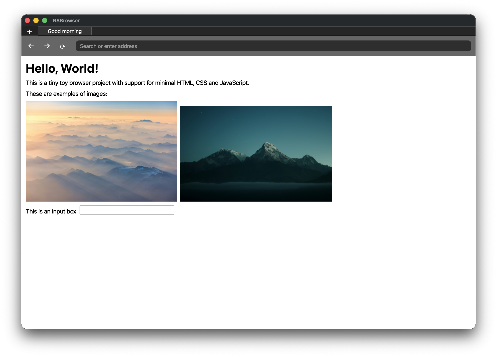
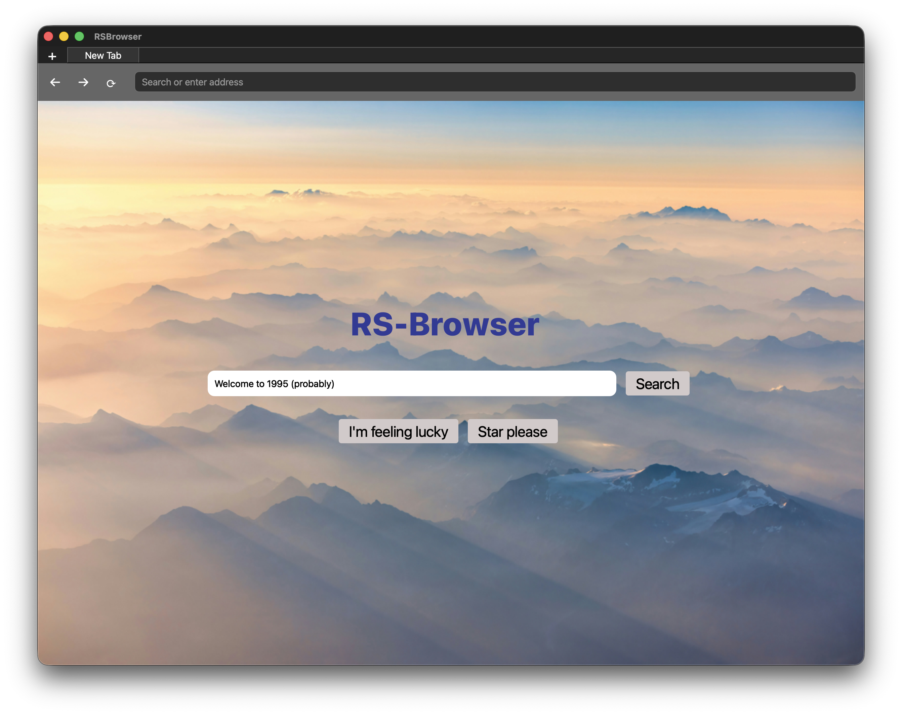

# RSBrowser

RSBrowser is a Qt 6 desktop prototype that renders a small subset of HTML into
native widgets. It is intended as a learning-oriented browser experiment, with
an emphasis on a simple HTML parsing pipeline and a lightweight widget renderer
rather than full web standards compliance.

## Screenshots




## Overview

The project is organized into small engines and a Qt-based UI:

- Equinox: HTML engine and parser used by the current build.
- Auroral: CSS engine (used for limited inline style parsing).
- Solstice: JavaScript engine (planned, not wired).
- UI: Qt widgets in w_browser/v_browser build a view tree from parsed nodes.

## Features

- Tabbed window with a minimal navigation bar (back/forward/refresh stubs).
- New tab page loaded from resources/home.html.
- HTML to Qt widget renderer with a small, explicit tag set.
- Basic inline style handling for div elements (width, height, border, flex).

### Supported tags

The renderer currently handles these tags:

- body
- h1, h2, h3, h4, h5, h6
- p
- img (with alt text and fallback image)
- input (text, checkbox, radio, date, datetime)
- label
- div (limited inline CSS and flex layout)
- button
- br (line breaks in inline flows)

## Requirements

- CMake 3.10 or newer
- A C++17-capable compiler
- Qt 6 with Widgets, Core, Gui, Network, Sql, and Xml components
- Internet access during configure (FetchContent pulls mimalloc)

## Building and Installing

The top-level CMakeLists.txt contains a local Qt path for one developer.
You should set your own Qt path either by editing the file or by passing
CMAKE_PREFIX_PATH at configure time.

Example build:

```
cmake -S . -B build -DCMAKE_PREFIX_PATH=/path/to/Qt/6.x.x/macos
cmake --build build
```

## Running

Run the executable from the build directory so relative resource paths resolve
correctly (resources/home.html is read using a relative path).

```
cd build
./rsbrowser
```

## Configuration and Environment

Optional mimalloc debug usage (macOS example from notes.txt):

```
env DYLD_INSERT_LIBRARIES="$PWD/build/_deps/mimalloc-build/libmimalloc-debug.dylib" \
    MIMALLOC_VERBOSE=1 \
    "$PWD/build/rsbrowser"
```

If you do not need mimalloc diagnostics, just run rsbrowser normally.

## Tests

Equinox and Auroral have test targets configured. After building, you can run
ctest from the build directory:

```
ctest --test-dir build
```

## Documentation

A Doxygen configuration is provided in Doxyfile. To generate API docs:

```
doxygen Doxyfile
```

The Doxygen main page is defined in main.hpp.

## Directory Layout

- auroral/       CSS parser engine
- equinox/       HTML parser engine
- solstice/      JavaScript engine (placeholder)
- resources/     HTML and image assets used at runtime
- docs/images/   Project screenshots for documentation

## Status and Roadmap

RSBrowser is an early-stage prototype. The rendering system focuses on a small
subset of HTML and inline styling. CSS and JavaScript engines are incomplete and
not fully integrated into the application UI.

## Reporting Bugs

Please include your OS, Qt version, and a minimal HTML example that reproduces
any issue. If the problem involves rendering, include a screenshot and the
resources/home.html content you used.

## Copying

See [LICENSE](LICENSE)